# Sakila Database Queries
Query examples
---

#### 1a. Display the first and last names of all actors from the table `actor`.

Query: 
```sql
select first_name, last_name 
from actor;
```
Result:

  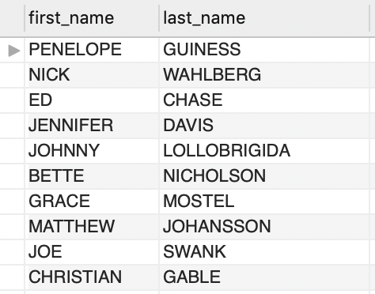

#### 1b. Display the first and last name of each actor in a single column in upper case letters. Name the column `Actor Name`.

Query:
```sql
select upper(concat(first_name, ' ', last_name))   'Actor Name'
from actor;
```
Result:

  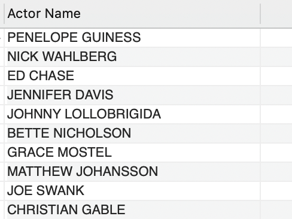

#### 2a. You need to find the ID number, first name, and last name of an actor, of whom you know only the first name, "Joe." What is one query would you use to obtain this information?

Query: 
```sql
select actor_id, first_name, last_name 
from actor 
where lower(first_name) = lower("Joe");
```
Result:

  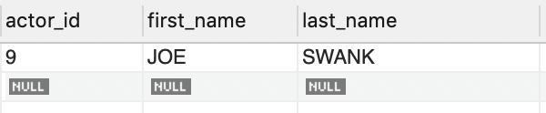

#### 2b. Find all actors whose last name contain the letters `GEN`:

Query: 
```sql
select * 
from actor 
where upper(last_name) like '%GEN%';
```
Result:

  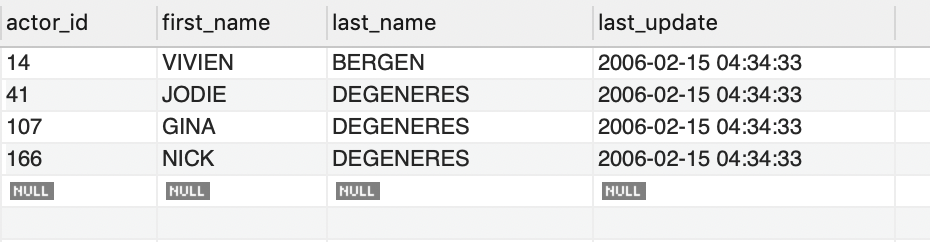

#### 2c. Find all actors whose last names contain the letters `LI`. This time, order the rows by last name and first name, in that order:

Query: 
```sql
select * 
from actor 
where upper(last_name) like '%LI%' 
order by last_name, first_name;
```
Result:

  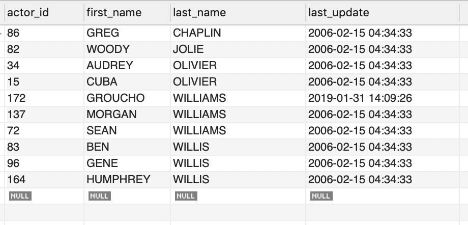

#### 2d. Using `IN`, display the `country_id` and `country` columns of the following countries: Afghanistan, Bangladesh, and China:

Query: 
```sql
select country_id, country 
from country 
where country in ('Afghanistan', 'Bangladesh', 'China');
```
Result:

  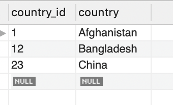

#### 3a. You want to keep a description of each actor. You don't think you will be performing queries on a description, so create a column in the table `actor` named `description` and use the data type `BLOB` (Make sure to research the type `BLOB`, as the difference between it and `VARCHAR` are significant).

According to Ozair Kafray @ [Stackexchange.com](https://softwareengineering.stackexchange.com/questions/154786/is-a-blob-more-efficient-than-a-varchar-for-data-that-can-be-any-size)

```md
I would suggest using TEXT over BLOB.

Primary Difference

- TEXT and BLOB is stored off the table with the table just having a pointer to the location of the actual storage.
- VARCHAR is stored inline with the table.

Primary Guideline

1. Text format messages should almost always be stored as TEXT (they end up being arbitrarily long)
2. String attributes should be stored as VARCHAR (the destination user name, the subject, etc...).
```

Query: 
```sql
select * from actor;

ALTER TABLE actor
ADD COLUMN description BLOB;

select * from actor;
```
Result:

  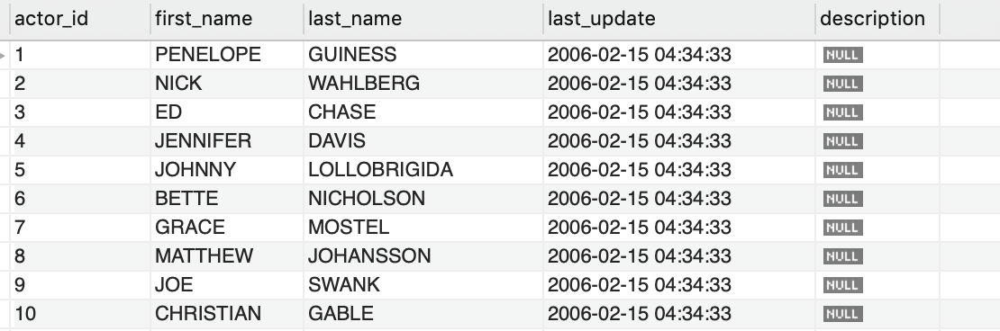

#### 3b. Very quickly you realize that entering descriptions for each actor is too much effort. Delete the `description` column.

Query: 
```sql
select * from actor;

alter table actor
drop column description;

select * from actor;
```
Result:

  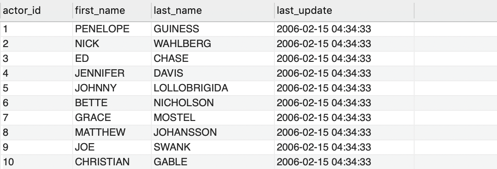

#### 4a. List the last names of actors, as well as how many actors have that last name.

Query: 
```sql
select last_name, count(*) actor_count 
from actor 
group by last_name
order by actor_count desc, last_name;
```
Result:

  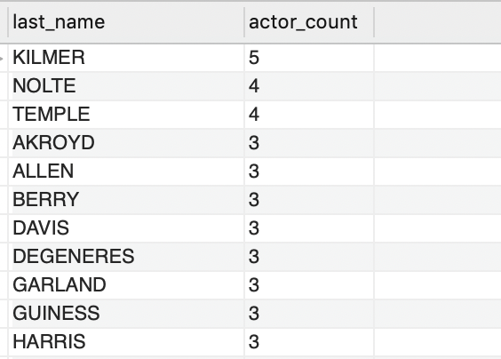

#### 4b. List last names of actors and the number of actors who have that last name, but only for names that are shared by at least two actors

Query: 
```sql
select last_name, count(*) actor_count 
from actor 
group by last_name
having actor_count >1
order by actor_count desc, last_name;
```
Result:

  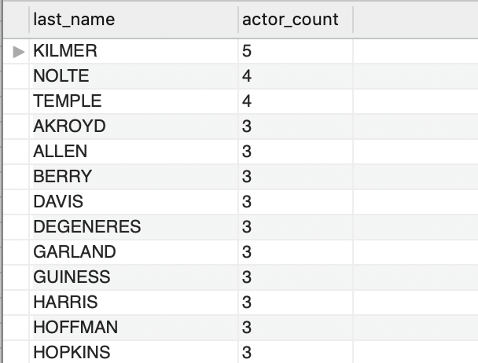

#### 4c. The actor `HARPO WILLIAMS` was accidentally entered in the `actor` table as `GROUCHO WILLIAMS`. Write a query to fix the record.

Query: 
```sql
select * from actor where first_name = 'GROUCHO' and last_name = 'WILLIAMS';

update actor set first_name = 'HARPO', last_name = 'WILLIAMS' where first_name = 'GROUCHO' and last_name = 'WILLIAMS';

select * from actor where last_name = 'WILLIAMS';
```
Result:

  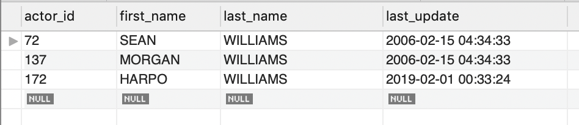

#### 4d. Perhaps we were too hasty in changing `GROUCHO` to `HARPO`. It turns out that `GROUCHO` was the correct name after all! In a single query, if the first name of the actor is currently `HARPO`, change it to `GROUCHO`.

Query: 
```sql
update actor set first_name = 'GROUCHO', last_name = 'WILLIAMS' where first_name = 'HARPO' and last_name = 'WILLIAMS';

select * from actor where last_name = 'WILLIAMS';
```
Result:

  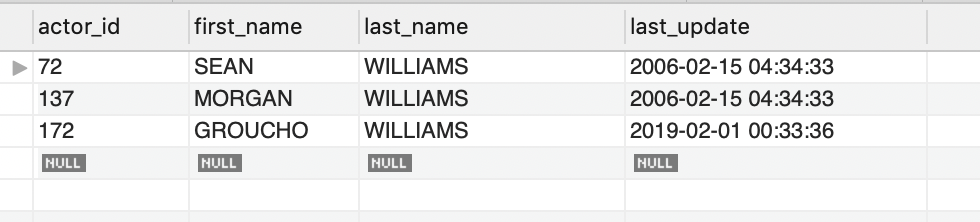

#### 5a. You cannot locate the schema of the `address` table. Which query would you use to re-create it?


Query: 
```sql
SHOW CREATE TABLE address;
```

Result:


  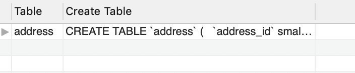

```sql
CREATE TABLE `address` (
  `address_id` smallint(5) unsigned NOT NULL AUTO_INCREMENT,
  `address` varchar(50) NOT NULL,
  `address2` varchar(50) DEFAULT NULL,
  `district` varchar(20) NOT NULL,
  `city_id` smallint(5) unsigned NOT NULL,
  `postal_code` varchar(10) DEFAULT NULL,
  `phone` varchar(20) NOT NULL,
  `location` geometry NOT NULL,
  `last_update` timestamp NOT NULL DEFAULT CURRENT_TIMESTAMP ON UPDATE CURRENT_TIMESTAMP,
  PRIMARY KEY (`address_id`),
  KEY `idx_fk_city_id` (`city_id`),
  SPATIAL KEY `idx_location` (`location`),
  CONSTRAINT `fk_address_city` FOREIGN KEY (`city_id`) REFERENCES `city` (`city_id`) ON UPDATE CASCADE
) ENGINE=InnoDB AUTO_INCREMENT=606 DEFAULT CHARSET=utf8
```


#### 6a. Use `JOIN` to display the first and last names, as well as the address, of each staff member. Use the tables `staff` and `address`:

Query: 
```sql
select stf.first_name, stf.last_name, adr.address, adr.district, adr.postal_code, adr.city_id 
from staff stf
left join address adr
on stf.address_id = adr.address_id;
```
Result:

  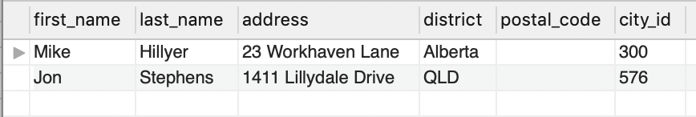

#### 6b. Use `JOIN` to display the total amount rung up by each staff member in August of 2005. Use tables `staff` and `payment`.

Query: 
```sql
select stf.first_name, stf.last_name, sum(pay.amount)
from staff stf
left join payment pay
on stf.staff_id = pay.staff_id
WHERE month(pay.payment_date) = 8
and year(pay.payment_date)  = 2005
group by stf.first_name, stf.last_name;
```
Result:

  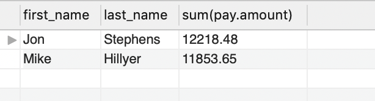

#### 6c. List each film and the number of actors who are listed for that film. Use tables `film_actor` and `film`. Use inner join.

Query: 
```sql
select flm.title, count(*) number_of_actors
from film flm
inner join film_actor fim_act
on flm.film_id = fim_act.film_id
group by flm.title
order by number_of_actors desc;
```
Result:

  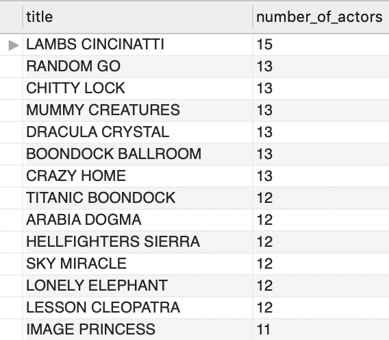

#### 6d. How many copies of the film `Hunchback Impossible` exist in the inventory system?

Query: 
```sql
select flm.title, count(*) number_in_inventory
from film flm
inner join inventory inv
on flm.film_id = inv.film_id
where lower(flm.title) = lower('Hunchback Impossible')
group by flm.title;
```
Result:

  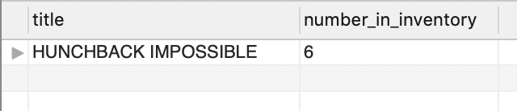

#### 6e. Using the tables `payment` and `customer` and the `JOIN` command, list the total paid by each customer. List the customers alphabetically by last name:

Query: 
```sql
select cust.first_name, cust.last_name, sum(pay.amount) 'Total Amount Paid' 
from payment pay
join customer cust
on pay.customer_id = cust.customer_id
group by cust.first_name, cust.last_name
order by cust.last_name;
```
Result:

  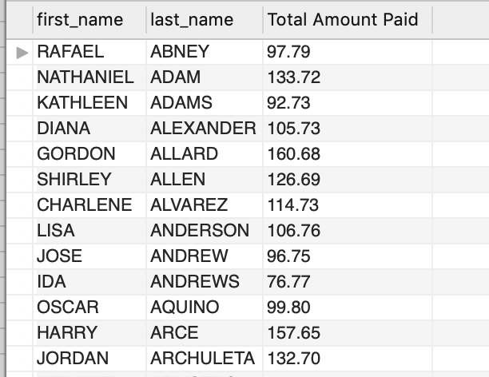


#### 7a. The music of Queen and Kris Kristofferson have seen an unlikely resurgence. As an unintended consequence, films starting with the letters `K` and `Q` have also soared in popularity. Use subqueries to display the titles of movies starting with the letters `K` and `Q` whose language is English.

Query: 
```sql
select title
from film 
where (title like 'K%' or title like 'Q%')
and language_id in (
	select language_id 
	from language 
	where name = 'English'
)
order by title;
```
Result:

  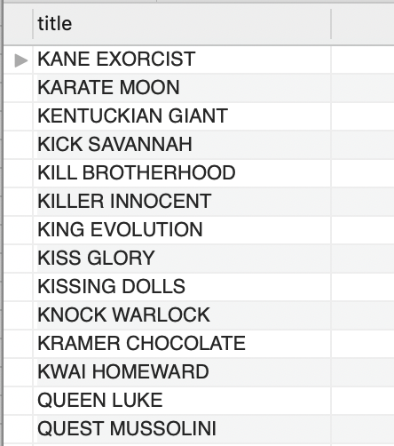

#### 7b. Use subqueries to display all actors who appear in the film `Alone Trip`.

Query: 
```sql
select first_name, last_name 
from actor
where actor_id in (
	select actor_id
	from film_actor
	where film_id in (
		select film_id from film where lower(title) = lower('Alone Trip')
	)
);
```
Result:

  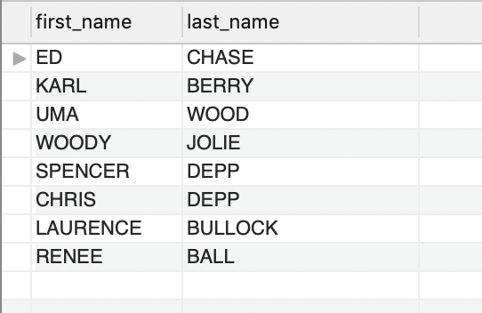

#### 7c. You want to run an email marketing campaign in Canada, for which you will need the names and email addresses of all Canadian customers. Use joins to retrieve this information.

Query: 
```sql
-- Subquery
select first_name, last_name, email
from customer
where address_id in (
	select address_id
	from address
	where city_id in (
		select city_id
		from city
		where country_id in (
			select country_id
			from country
			where country = 'Canada'
		)
	)
);

-- Join

select cus.first_name, cus.last_name, cus.email
from customer cus
join address adr
on cus.address_id = adr.address_id
join city cit
on adr.city_id = cit.city_id
join country cou
on cit.country_id = cou.country_id
where cou.country = 'Canada';
```
Result:

  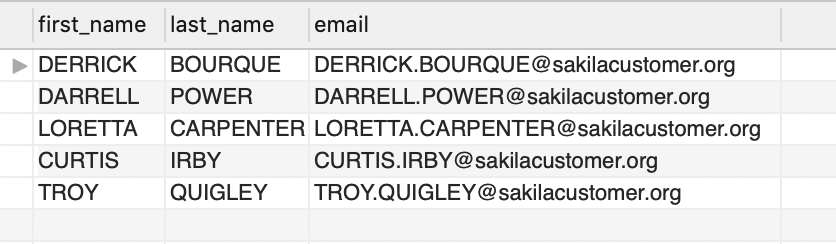

#### 7d. Sales have been lagging among young families, and you wish to target all family movies for a promotion. Identify all movies categorized as _family_ films.

Query: 
```sql
select film_id, title, release_year
from film
where film_id in (
	select film_id
	from film_category
	where category_id in (
		select category_id
		from category
		where name = 'Family'
	)
);
```
Result:

  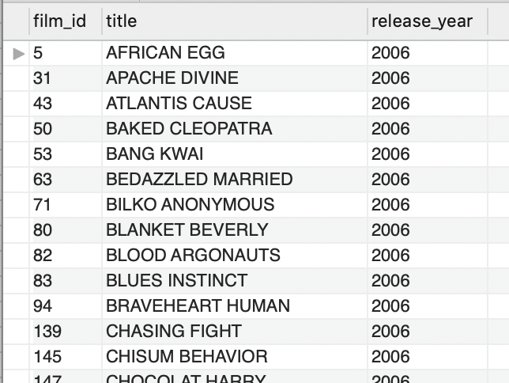

#### 7e. Display the most frequently rented movies in descending order.

Query: 
```sql
select A.film_id, A.title, B.*
from film A
join (
	select inv.film_id, count(ren.rental_id) times_rented
	from rental ren
	join inventory inv
	on ren.inventory_id = inv.inventory_id
	group by inv.film_id
) B
on A.film_id = B.film_id
order by B.times_rented desc;
```
Result:

  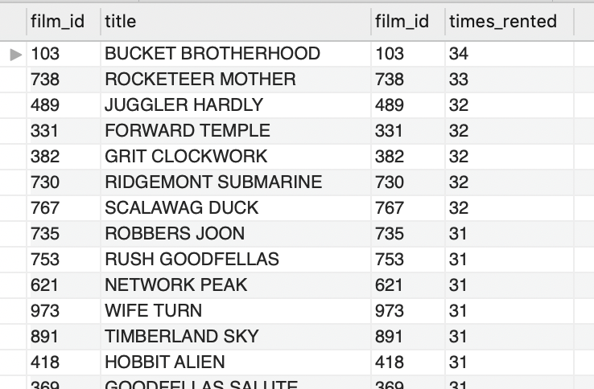

#### 7f. Write a query to display how much business, in dollars, each store brought in.

Query: 
```sql
select A.store_id, B.sales 
from store A
join (
	select cus.store_id, sum(pay.amount) sales
	from customer cus
	join payment pay
	on pay.customer_id = cus.customer_id
group by cus.store_id
) B
on A.store_id = B.store_id
order by a.store_id;
```
Result:

  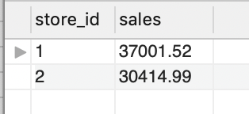

#### 7g. Write a query to display for each store its store ID, city, and country.

Query: 
```sql
select A.*, B.sales 
from (
	select sto.store_id, cit.city, cou.country
	from store sto
	left join address adr
	on sto.address_id = adr.address_id
	join city cit
	on adr.city_id = cit.city_id
	join country cou
	on cit.country_id = cou.country_id
) A
join (
	select cus.store_id, sum(pay.amount) sales
	from customer cus
	join payment pay
	on pay.customer_id = cus.customer_id
	group by cus.store_id
) B
on A.store_id = B.store_id
order by a.store_id;
```
Result:

  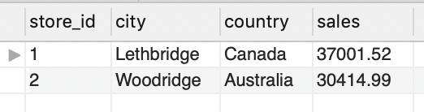

#### 7h. List the top five genres in gross revenue in descending order. (**Hint**: you may need to use the following tables: category, film_category, inventory, payment, and rental.)

Query: 
```sql
select cat.name category_name, sum( IFNULL(pay.amount, 0) ) revenue
from category cat
left join film_category flm_cat
on cat.category_id = flm_cat.category_id
left join film fil
on flm_cat.film_id = fil.film_id
left join inventory inv
on fil.film_id = inv.film_id
left join rental ren
on inv.inventory_id = ren.inventory_id
left join payment pay
on ren.rental_id = pay.rental_id
group by cat.name
order by revenue desc
limit 5;
```
Result:

  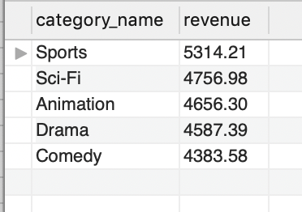

#### 8a. In your new role as an executive, you would like to have an easy way of viewing the Top five genres by gross revenue. Use the solution from the problem above to create a view. If you haven't solved 7h, you can substitute another query to create a view.

Query: 
```sql
create view top_five_genres as
select cat.name category_name, sum( IFNULL(pay.amount, 0) ) revenue
from category cat
left join film_category flm_cat
on cat.category_id = flm_cat.category_id
left join film fil
on flm_cat.film_id = fil.film_id
left join inventory inv
on fil.film_id = inv.film_id
left join rental ren
on inv.inventory_id = ren.inventory_id
left join payment pay
on ren.rental_id = pay.rental_id
group by cat.name
order by revenue desc
limit 5;
```

#### 8b. How would you display the view that you created in 8a?

Query: 
```sql
select * from top_five_genres;
```
Result:

  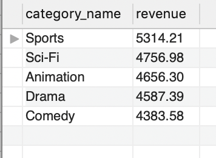

#### 8c. You find that you no longer need the view `top_five_genres`. Write a query to delete it.

Query: 
```sql
drop view top_five_genres;
```